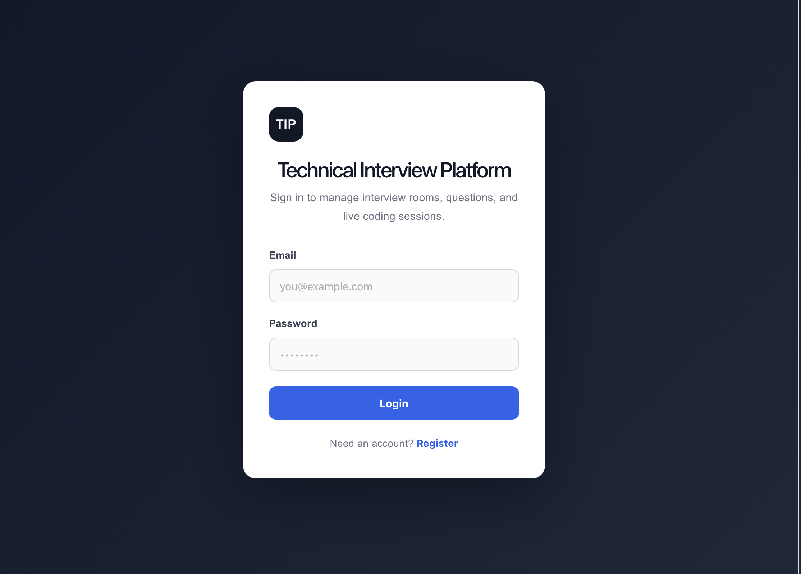
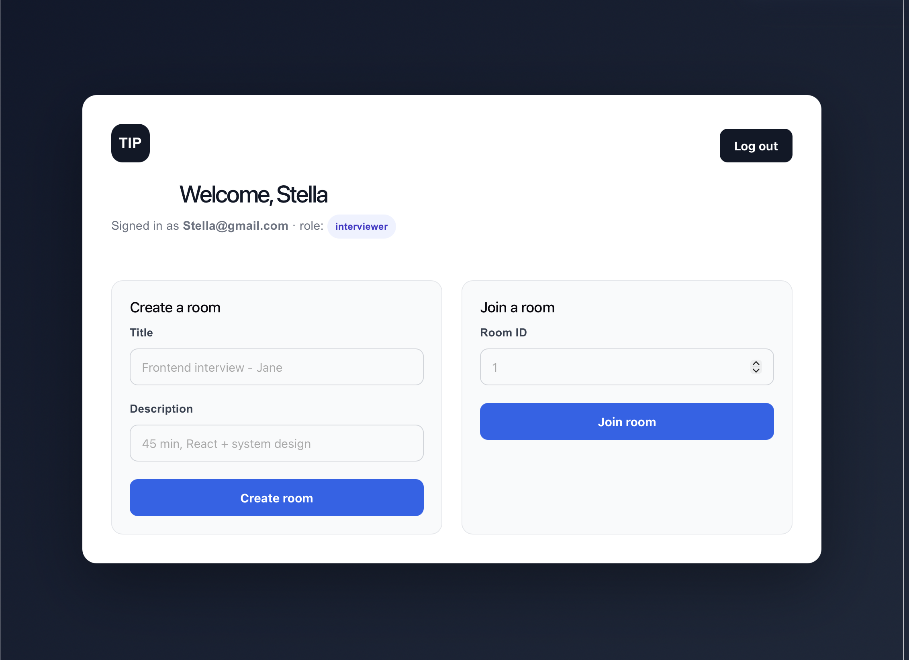
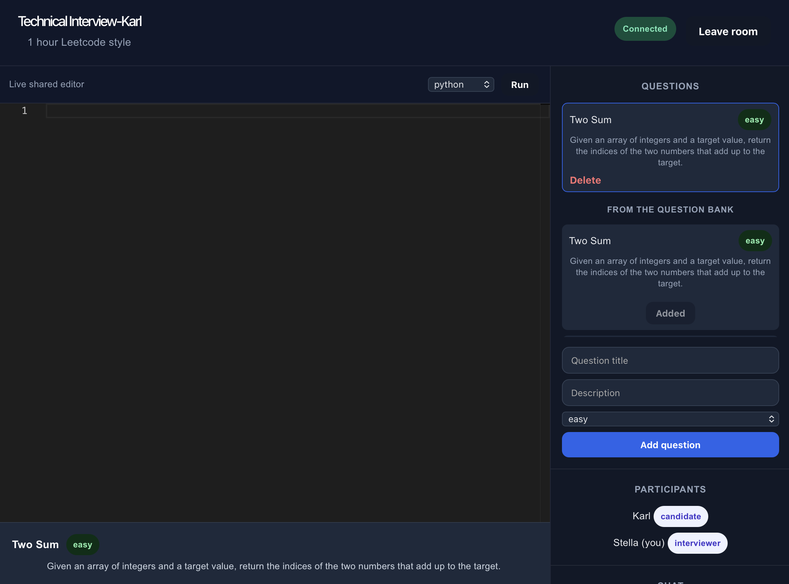
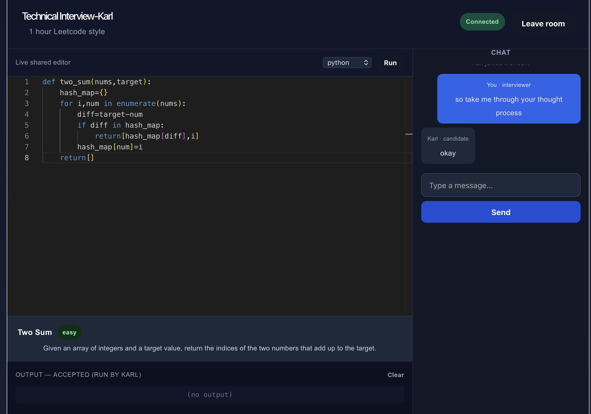
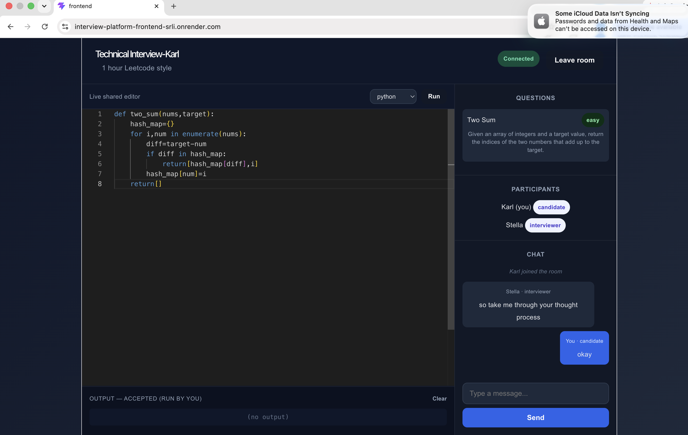

# Technical Interview Platform

A full-stack web app for running live, collaborative technical interviews — a shared Monaco code editor, live chat, multi-language code execution, and a reusable question bank, all synchronized in real time over WebSockets.

**Live demo:** https://interview-platform-frontend-srli.onrender.com
*(free-tier hosting — the first load after a period of inactivity can take 30-50s while the backend wakes up)*

To try it as an interviewer, register with invite code `interview-me-2026` (or leave it blank to register as a candidate).

---

## Screenshots

**Sign in**


**Dashboard — create or join a room**


**Setting up a room** — the interviewer picks a question from the bank and can delete it if needed


**Real-time sync, from both sides of the same session** — the interviewer's screen (left) and the candidate's screen (right) update live as code is typed, chat messages are sent, and code is run
<table>
<tr>
<td></td>
<td></td>
</tr>
</table>

---

## Features

- **Live collaborative editor** — a Monaco (VS Code) editor synchronized across every participant in a room in real time, with syntax highlighting across 6 languages
- **Multi-language code execution** — run the shared code and broadcast the actual output (stdout/stderr) to everyone in the room simultaneously, not just the person who clicked Run
- **Question bank** — a reusable, seeded library of interview questions interviewers can drop into any room in one click, instead of retyping the same questions every session
- **Live chat** and a real-time participant list per room
- **Role-based access** — interviewers and candidates have different permissions; room *ownership* (not just a role label) gates who can manage questions and run the interview, preventing a participant from hijacking someone else's session
- **Invite-code gated interviewer signup** — registration defaults everyone to `candidate`; only someone with the correct invite code becomes an `interviewer`, closing off a privilege-escalation path that existed earlier in development (see below)

## Tech stack

| Layer | Technology |
|---|---|
| Frontend | React (Vite), Monaco Editor |
| Backend | FastAPI, WebSockets |
| Database | PostgreSQL, SQLAlchemy |
| Auth | JWT (python-jose), bcrypt |
| Code execution | Judge0 (sandboxed, external execution API) |
| Testing | pytest, isolated SQLite test database |
| Deployment | Render (separate frontend/backend services + managed Postgres) |

## Architecture

```
┌─────────────┐        REST (JWT auth)        ┌──────────────┐
│   React     │ ─────────────────────────────▶│   FastAPI     │
│  (frontend) │                                 │  (backend)   │
│             │◀──────────────────────────────  │              │
└─────────────┘        WebSocket (live sync)    └───────┬──────┘
                                                          │
                                          ┌───────────────┼────────────────┐
                                          ▼                                ▼
                                   ┌─────────────┐                ┌───────────────┐
                                   │ PostgreSQL  │                │  Judge0 API   │
                                   │  (rooms,    │                │ (sandboxed    │
                                   │  users,     │                │  code exec)   │
                                   │  questions) │                └───────────────┘
                                   └─────────────┘
```

Every WebSocket connection is scoped to a single room (`room_id`), so code updates, chat, question selection, and code-execution output broadcast only to the people actually in that room — rooms never see each other's traffic, and any number of interviews can run concurrently and independently.

## Notable engineering decisions

A few things worth knowing if you're reading the code or asking about this project:

- **Ownership over role-based permissions.** Room management (adding questions, selecting the active one) is gated by "do you own this room," not just "are you an interviewer." This closes a gap where any interviewer-labeled participant could hijack a room they didn't create.
- **Constant-time invite-code comparison.** The interviewer invite code is checked with `secrets.compare_digest` rather than `==`, avoiding a timing side-channel on a security-relevant comparison.
- **External sandboxed code execution.** Rather than running user-submitted code as a subprocess on the backend (a real remote-code-execution risk), execution is delegated to Judge0, an external sandboxed service — the tradeoff is a dependency on a third party instead of building and securing a sandbox in-house.
- **Debugged a self-inflicted WebSocket bug**: a single failed broadcast to one disconnecting client was silently corrupting the connection manager's state for the entire room, blocking all future real-time updates for everyone else. Fixed by making broadcast failures isolated per-connection instead of fatal to the whole room.
- **Load-tested, not guessed.** Concurrency and latency numbers referenced for this project came from an actual WebSocket load-testing script run against the live deployment (12 concurrent connections across 3 simultaneous rooms, ~112ms median broadcast latency) — not estimates.

## Local development

**Backend**
```sh
cd backend
python3 -m venv venv
source venv/bin/activate
pip install -r requirements.txt
cp .env.example .env   # then fill in DATABASE_URL, SECRET_KEY, etc.
uvicorn main:app --reload --port 8001
```

**Frontend**
```sh
cd frontend
npm install
npm run dev
```

Then open `http://localhost:5173`.

## Testing

```sh
cd backend
source venv/bin/activate
pip install -r requirements-dev.txt
python3 -m pytest tests/ -v
```

20 tests covering password hashing/JWT round-trips, registration and invite-code role assignment, login/`/me` auth checks, and the WebSocket connection authorization gate (including that a participant's role always comes from their account, never client input) — run against an isolated temporary SQLite database, never your real dev/production data.

## Deployment

Deployed on [Render](https://render.com) via the included [`render.yaml`](render.yaml) Blueprint, which provisions a managed Postgres database, the FastAPI backend, and the static frontend build together. See `.env.example` in both `backend/` and `frontend/` for the environment variables each service needs.
